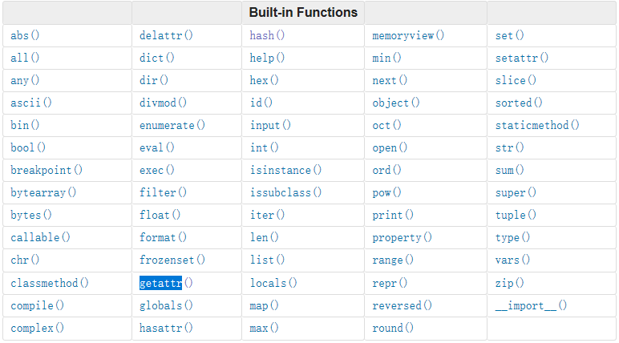

# [Overview](https://docs.python.org/3/library/functions.html)

# [Group by function](https://blog.csdn.net/qwxwaty/article/details/80384765)

## Math

**Must know**
- float([x])
- int([x[,base]])
- range([start,] stop[, step])

**Good to know**
- round(x[,n])
- complex(r, i)
- sum(x)
- abs(x)
- pow(x, y[,z])
- oct(x)
- hex(x)
- chr(x)
- bin(x)
- bool(x)
- divmod(x)

## Collection

**Must know**
- tuple(...)
- list(...)
- dict(...)
- set(...)
- enumerate(sequence, start=0)
- zip(...)
- len(...)

**Good to know**
- max(...)
- min(...)
- sorted(...)
- map(...)
- filter(...)
- iter(...)
- format(...)
- slice(...)
- reversed(...)

## Logoic
**Good to know**
- all(...)
- any(...)
- cmp(x, y)

# Reflection

**Must know**
- dir(...)
- getattr(...)
- hasattr(...)
- isinstance(...)

**Good to know**
- callable(...)
- delattr(...)
- issubclass(...)
- locals()
- setattr(...)

...

# IO

**Must know**
- open(...)
- print(...)
- input(...)

# [Built-in class attributes](https://dyclassroom.com/python/python-built-in-class-attributes#:~:text=Python%20-%20Built-in%20Class%20Attributes%20%20%20,in%20%20...%20%201%20more%20rows%20)

| Attribute | Description |
| ---- | ---- |
| \_\_dict\_\_ | This is a dictionary holding the class namespace.|
| \_\_doc\_\_ | This gives us the class documentation if documentation is present. None otherwise. |
| \_\_name\_\_ | This gives us the class name.|
| \_\_module\_\_ | This gives us the name of the module in which the class is defined.|
| \_\_bases\_\_ | A possibly empty tuple containing the base classes in the order of their occurrence.|

# [Built-in module attributes](https://www.tutorialsteacher.com/python/python-module-attributes)

| Attribute | Description |
| ---- | ---- |
| \_\_dict\_\_ | This is a dictionary holding the module attributes.|
| \_\_doc\_\_ | This gives us the module documentation if documentation is present. None otherwise. |
| \_\_name\_\_ | module name, /_/_main/_/_ when run any python script.|
| \_\_file\_\_ | The path of module.|

