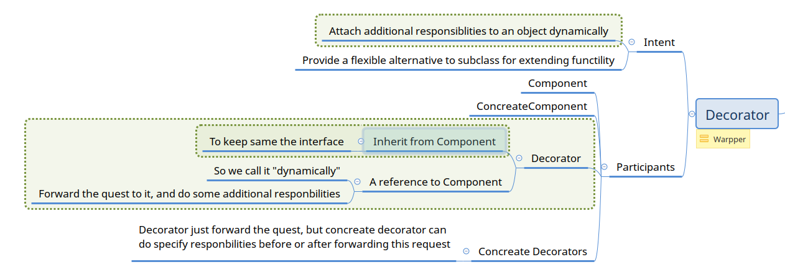

# closure

https://www.programiz.com/python-programming/closure


```python
def get_config_table():
    cfg = {'a':1, 'b':2}
    return cfg

def get_config_index():
    config_table = get_config_table()
    def wrapper(cfg_name):
        return config_table.get(cfg_name, 'NULL')
    return wrapper
```


```python
f=get_config_index()
```


```python
f('a')
```


    1


# decorator

## decorator pattern


## Simple demo


```python
from datetime import datetime
from functools import wraps
def time_this(func):
    #@wraps(func)
    def wrapper(*args, **kwargs):
        begin = datetime.now()
        res = func(*args, **kwargs)
        end = datetime.now()
        print("{} costs:{}".format(func.__name__, end - begin))
        return res
    return wrapper

@time_this
def count(num):
    import time
    time.sleep(num)

def count1(num):
    import time
    time.sleep(num)
count1 = time_this(count1)

count(2)
count1(2)
class Foo:
    @time_this
    def _sub(self, n):
        print("_sub")
    @time_this
    def foo1(self, num):
        self._sub(9)
        print("Foo.foo1")
f = Foo()
f.foo1(2)
```

    count costs:0:00:02.000687
    count1 costs:0:00:02.000561
    _sub
    _sub costs:0:00:00.000988
    Foo.foo1
    foo1 costs:0:00:00.000988
    

## Discussion
- decorating happens durning import
- understand it by *count = time_this(count)*, syntactic suger make it easy to use but far to understand
- cellphone case
 - make a cellphone
 - make cellphone wrapper
 - wrap--->return a closure which stores the function

- a case of closure

## With parameter

### Define


```python
from functools import wraps

def requires_permission(sPermission):                            
    def decorator(fn):
        @wraps(fn)
        def decorated(*args,**kwargs):       
            print("by function decorator")
            lPermissions = get_permissions(current_user_id())     
            if sPermission in lPermissions:                       
                return fn(*args,**kwargs)                         
            raise Exception("You need '{}' permission".format(sPermission))                  
        return decorated                                          
    return decorator       

def get_permissions(iUserId):
    return {1: ('logged_in', 'premium_member')}[iUserId]
                         
@requires_permission('administrator')
def delete_user(iUserId):
    pass

@requires_permission('logged_in')
def new_game():
    pass

@requires_permission('premium_member')
def premium_checkpoint():
    pass

def current_user_id():
    return 1
```

### Test


```python
def test():
    from functools import partial
    for fun in (partial(delete_user, 1), new_game, premium_checkpoint):
        try:
            fun()
        except Exception as e:
            print("test {} with error '{}'".format(fun, str(e)))
        else:
            print("test {} OK".format(fun))

test()
```

    test functools.partial(<function require_permission_by_class_v1.__call__.<locals>.wrapper at 0x00000215357198B8>, 1) with error 'permission denied'
    test <__main__.require_permission_by_class object at 0x0000021534BA32C8> OK
    test <__main__.require_permission_by_class object at 0x0000021534BA3FC8> OK
    

## Decorator as class


```python
class require_permission_by_class(object):
    def __init__(self, permission, func):
        self._func = func
        self._permission = permission
    def __call__(self, *args, **kwargs):
        print("by class for {}".format(self._func.__name__))
        lPermissions = get_permissions(current_user_id())     
        if self._permission in lPermissions:                       
            return self._func(*args,**kwargs)                         
        raise Exception("permission denied")
        
def get_permissions(iUserId):
    return {1: ('logged_in', 'premium_member')}[iUserId]
                         
def delete_user(iUserId):
    pass
delete_user=require_permission_by_class('administrator', delete_user)


def new_game():
    pass
new_game=require_permission_by_class('logged_in', new_game)


dec1=lambda f:require_permission_by_class('premium_member', f)
@dec1
def premium_checkpoint():
    pass

#premium_checkpoint=require_permission_by_class('premium_member', premium_checkpoint)

def current_user_id():
    return 1

def test():
    from functools import partial
    for fun in (partial(delete_user, 1), new_game, premium_checkpoint):
        try:
            fun()
        except Exception as e:
            print("test {} with error '{}'".format(fun, str(e)))
        else:
            print("test {} OK".format(fun))

test()
```

    by class for delete_user
    test functools.partial(<__main__.require_permission_by_class object at 0x0000021534C20348>, 1) with error 'permission denied'
    by class for new_game
    test <__main__.require_permission_by_class object at 0x0000021535441948> OK
    by class for premium_checkpoint
    test <__main__.require_permission_by_class object at 0x0000021534D18C08> OK
    

### Another way


```python
class require_permission_by_class_v1(object):
    def __init__(self, permission):
        self._permission = permission
    def __call__(self, func, *args, **kwargs):
        def wrapper(*args, **kwargs):
            print("by class v1 for {}".format(func.__name__))
            lPermissions = get_permissions(current_user_id())     
            if self._permission in lPermissions:                       
                return self._func(*args,**kwargs)
            raise Exception("permission denied")
        return wrapper

@require_permission_by_class_v1('administrator')
def delete_user(iUserId):
    pass
#delete_user=require_permission_by_class_v1('administrator')(delete_user)
```

#### Test


```python
test()
```

    by class v1 for delete_user
    test functools.partial(<function require_permission_by_class_v1.__call__.<locals>.wrapper at 0x0000021534F9FCA8>, 1) with error 'permission denied'
    by class for new_game
    test <__main__.require_permission_by_class object at 0x0000021535441948> OK
    by class for premium_checkpoint
    test <__main__.require_permission_by_class object at 0x0000021534D18C08> OK
    

## decorate multiple times


```python
def retry(nums):
    def decorator(fun):
        def wrapper(*args, **kwargs):
            for i in range(nums):
                try:
                    return fun(*args, **kwargs)
                except Exception as e:
                    print("{} fail{}".format(fun.__name__, ' retry...' if i < nums -1 else ''))
        return wrapper
    return decorator

@time_this
@retry(3)
def must_be_fail():
    raise Exception("bad guy")

must_be_fail()
```

## Summary
- Add aditional function before and after function
- Know the classic usage cases to give you enlightenment:
   - log
   - time cost
   - exception handle
   - permission manager
   - retry
   - ...


```python

```
