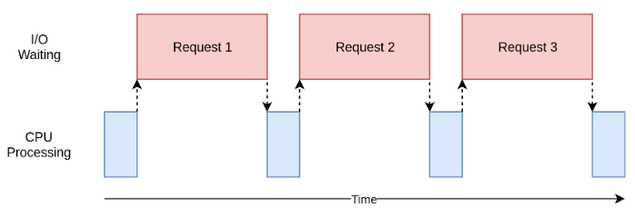
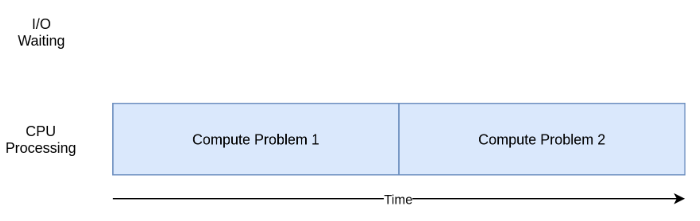
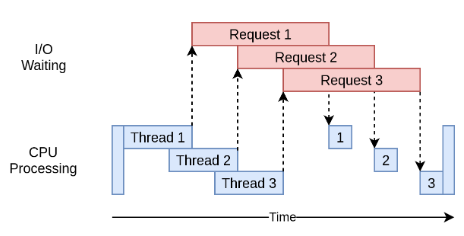
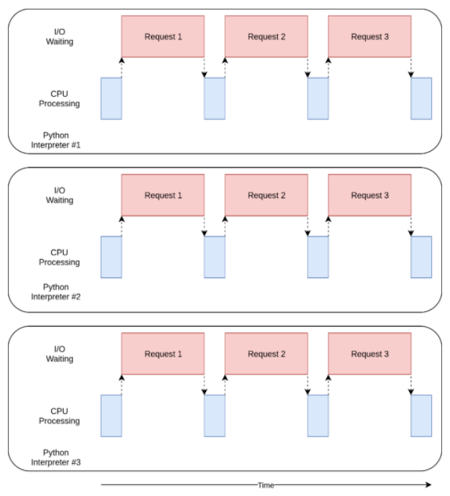
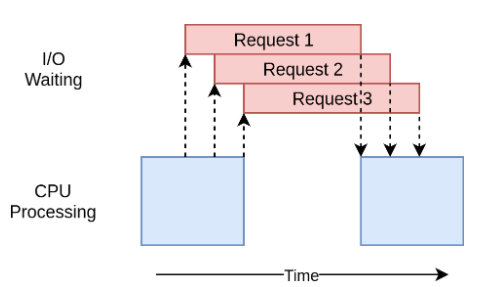

<h1>Table of Contents<span class="tocSkip"></span></h1>
<div class="toc"><ul class="toc-item"><li><span><a href="#Concurrency" data-toc-modified-id="Concurrency-1"><span class="toc-item-num">1&nbsp;&nbsp;</span>Concurrency</a></span></li><li><span><a href="#When-is-concurrency-usefule" data-toc-modified-id="When-is-concurrency-usefule-2"><span class="toc-item-num">2&nbsp;&nbsp;</span>When is concurrency usefule</a></span><ul class="toc-item"><li><span><a href="#Summary" data-toc-modified-id="Summary-2.1"><span class="toc-item-num">2.1&nbsp;&nbsp;</span>Summary</a></span></li></ul></li><li><span><a href="#How-to-improve" data-toc-modified-id="How-to-improve-3"><span class="toc-item-num">3&nbsp;&nbsp;</span>How to improve</a></span><ul class="toc-item"><li><span><a href="#Synchronous-Version" data-toc-modified-id="Synchronous-Version-3.1"><span class="toc-item-num">3.1&nbsp;&nbsp;</span>Synchronous Version</a></span></li><li><span><a href="#Threading-Version" data-toc-modified-id="Threading-Version-3.2"><span class="toc-item-num">3.2&nbsp;&nbsp;</span>Threading Version</a></span><ul class="toc-item"><li><span><a href="#What-it-looks-like" data-toc-modified-id="What-it-looks-like-3.2.1"><span class="toc-item-num">3.2.1&nbsp;&nbsp;</span>What it looks like</a></span></li><li><span><a href="#downsides" data-toc-modified-id="downsides-3.2.2"><span class="toc-item-num">3.2.2&nbsp;&nbsp;</span>downsides</a></span></li></ul></li><li><span><a href="#asyncio-version" data-toc-modified-id="asyncio-version-3.3"><span class="toc-item-num">3.3&nbsp;&nbsp;</span>asyncio version</a></span><ul class="toc-item"><li><span><a href="#Discussion" data-toc-modified-id="Discussion-3.3.1"><span class="toc-item-num">3.3.1&nbsp;&nbsp;</span>Discussion</a></span></li><li><span><a href="#What-the-executions-looks-like" data-toc-modified-id="What-the-executions-looks-like-3.3.2"><span class="toc-item-num">3.3.2&nbsp;&nbsp;</span>What the executions looks like</a></span></li><li><span><a href="#downsides" data-toc-modified-id="downsides-3.3.3"><span class="toc-item-num">3.3.3&nbsp;&nbsp;</span>downsides</a></span></li></ul></li><li><span><a href="#multiprocessing-version" data-toc-modified-id="multiprocessing-version-3.4"><span class="toc-item-num">3.4&nbsp;&nbsp;</span>multiprocessing version</a></span><ul class="toc-item"><li><span><a href="#What-it-looks-like:" data-toc-modified-id="What-it-looks-like:-3.4.1"><span class="toc-item-num">3.4.1&nbsp;&nbsp;</span>What it looks like:</a></span></li><li><span><a href="#Discussion" data-toc-modified-id="Discussion-3.4.2"><span class="toc-item-num">3.4.2&nbsp;&nbsp;</span>Discussion</a></span></li></ul></li><li><span><a href="#CPU-Bound-Demos" data-toc-modified-id="CPU-Bound-Demos-3.5"><span class="toc-item-num">3.5&nbsp;&nbsp;</span>CPU-Bound Demos</a></span></li></ul></li><li><span><a href="#Summary" data-toc-modified-id="Summary-4"><span class="toc-item-num">4&nbsp;&nbsp;</span>Summary</a></span></li></ul></div>

## Concurrency
Refer to: https://realpython.com/python-concurrency/


| Concurrency Type | Switching Decision | Number of Processors |
| :--------------- | :----------------- | :------------------- |
| Pre-emptive multitasking (threading) | The operating system decides when to switch. | 1 |
| Cooperative multitasking (asyncio) | The tasks decide when to give up control. | 1 |
| Multiprocessing (multiprocessing) | The processes all run at the same time on different processors. | Many |

## When is concurrency usefule
Concurrency can make a big difference for two types of problems. These are generally called CPU-bound and I/O-bound.

**IO-bound problem**



Some cases: browser, RPC, DB access,...

---


**CPU-bound problem**



Some cases: algo, ML training/prediction, ...

### Summary
| I/O-Bound Process | CPU-Bound Process |
| :---------------- | :---------------- |
| Spends most of its time talking to a slow device: a network connection, a hard drive, or a printer. | Spends most of its time doing CPU operations. |
| Speeding it up involves overlapping the times spent waiting for these devices. | Speeding it up involves finding ways to do more computations in the same amount of time. |

## How to improve

### Synchronous Version


```python
import requests
import time

total_len = 0
def download_site(url, session):
    with session.get(url) as response:
        print(f"Read {len(response.content)} from {url}")
        global total_len
        total_len += len(response.content)

def download_all_sites(sites):
    with requests.Session() as session:
        for url in sites:
            download_site(url, session)

if __name__ == "__main__":
    sites = [
        "https://www.jython.org",
        "http://olympus.realpython.org/dice",
    ] * 10
    start_time = time.time()
    download_all_sites(sites)
    duration = time.time() - start_time
    print(f"total len:{total_len}")
    print(f"Downloaded {len(sites)} in {duration} seconds")
```

    Read 10394 from https://www.jython.org
    Read 277 from http://olympus.realpython.org/dice
    Read 10394 from https://www.jython.org
    Read 277 from http://olympus.realpython.org/dice
    Read 10394 from https://www.jython.org
    Read 277 from http://olympus.realpython.org/dice
    Read 10394 from https://www.jython.org
    Read 277 from http://olympus.realpython.org/dice
    Read 10394 from https://www.jython.org
    Read 277 from http://olympus.realpython.org/dice
    Read 10394 from https://www.jython.org
    Read 277 from http://olympus.realpython.org/dice
    Read 10394 from https://www.jython.org
    Read 277 from http://olympus.realpython.org/dice
    Read 10394 from https://www.jython.org
    Read 277 from http://olympus.realpython.org/dice
    Read 10394 from https://www.jython.org
    Read 277 from http://olympus.realpython.org/dice
    Read 10394 from https://www.jython.org
    Read 277 from http://olympus.realpython.org/dice
    total len:106710
    Downloaded 20 in 10.00223684310913 seconds
    

### Threading Version


```python
import concurrent.futures
import requests
import threading
import time

lock = threading.RLock()
thread_local = threading.local()

total_len = 0
def get_session():
    if not hasattr(thread_local, "session"):
        thread_local.session = requests.Session()
    return thread_local.session

def download_site(url):
    session = get_session()
    with session.get(url) as response:
        print(f"Read {len(response.content)} from {url}")
        global total_len
        with lock:
            total_len += len(response.content)

def download_all_sites(sites):
    with concurrent.futures.ThreadPoolExecutor(max_workers=5) as executor:
        executor.map(download_site, sites)

if __name__ == "__main__":
    sites = [
        "https://www.jython.org",
        "http://olympus.realpython.org/dice",
    ] * 10
    start_time = time.time()
    download_all_sites(sites)
    duration = time.time() - start_time
    print(f"total len:{total_len}")
    print(f"Downloaded {len(sites)} in {duration} seconds")
```

    Read 277 from http://olympus.realpython.org/dice
    Read 277 from http://olympus.realpython.org/dice
    Read 277 from http://olympus.realpython.org/dice
    Read 10394 from https://www.jython.org
    Read 10394 from https://www.jython.org
    Read 277 from http://olympus.realpython.org/dice
    Read 10394 from https://www.jython.org
    Read 277 from http://olympus.realpython.org/dice
    Read 10394 from https://www.jython.org
    Read 277 from http://olympus.realpython.org/dice
    Read 10394 from https://www.jython.org
    Read 277 from http://olympus.realpython.org/dice
    Read 277 from http://olympus.realpython.org/dice
    Read 10394 from https://www.jython.org
    Read 277 from http://olympus.realpython.org/dice
    Read 277 from http://olympus.realpython.org/dice
    Read 10394 from https://www.jython.org
    Read 10394 from https://www.jython.org
    Read 10394 from https://www.jython.org
    Read 10394 from https://www.jython.org
    total len:106710
    Downloaded 20 in 6.115782022476196 seconds
    

#### What it looks like



#### downsides
    - need take care of the data sharing(race conditions) between threads

### multiprocessing version

```python
import requests
import multiprocessing
import concurrent.futures
import time

session = None
len_queue = multiprocessing.Queue()

def set_global_session():
    global session
    if not session:
        session = requests.Session()

def download_site(url):
    with session.get(url) as response:
        name = multiprocessing.current_process().name
        print(f"{name}:Read {len(response.content)} from {url}")
        return len(response.content)

def download_all_sites(sites):
    # Both the following ways are OK
    # with multiprocessing.Pool(initializer=set_global_session) as pool:
    with concurrent.futures.ProcessPoolExecutor(initializer=set_global_session) as pool:
        res = pool.map(download_site, sites)
        print('total_len:', sum(res))


if __name__ == "__main__":
    sites = [
        "https://www.jython.org",
        "http://olympus.realpython.org/dice",
    ] * 10
    start_time = time.time()
    download_all_sites(sites)
    duration = time.time() - start_time
    print(f"Downloaded {len(sites)} in {duration} seconds")
```

Output:

```
SpawnProcess-1:Read 277 from http://olympus.realpython.org/dice
SpawnProcess-7:Read 277 from http://olympus.realpython.org/dice
SpawnProcess-4:Read 277 from http://olympus.realpython.org/dice
SpawnProcess-8:Read 277 from http://olympus.realpython.org/dice
SpawnProcess-7:Read 277 from http://olympus.realpython.org/dice
SpawnProcess-8:Read 277 from http://olympus.realpython.org/dice
SpawnProcess-2:Read 10394 from https://www.jython.org
SpawnProcess-6:Read 10394 from https://www.jython.org
SpawnProcess-5:Read 10394 from https://www.jython.org
SpawnProcess-8:Read 277 from http://olympus.realpython.org/dice
SpawnProcess-2:Read 10394 from https://www.jython.org
SpawnProcess-8:Read 277 from http://olympus.realpython.org/dice
SpawnProcess-2:Read 10394 from https://www.jython.org
SpawnProcess-6:Read 277 from http://olympus.realpython.org/dice
SpawnProcess-4:Read 10394 from https://www.jython.org
SpawnProcess-8:Read 277 from http://olympus.realpython.org/dice
SpawnProcess-1:Read 10394 from https://www.jython.org
SpawnProcess-5:Read 10394 from https://www.jython.org
SpawnProcess-3:Read 10394 from https://www.jython.org
SpawnProcess-7:Read 10394 from https://www.jython.org
total_len: 106710
Downloaded 20 in 9.592671155929565 seconds
```

#### What it looks like:


#### Discussion
    - run across multiple CPUs
    - heavyweight than multiple threads
    - processes number is determine by your number of CPUs in your computer default
    - The data sharing need serialize and deserialize between processes
    

### asyncio version


```python
import asyncio
import time
import aiohttp
import nest_asyncio
nest_asyncio.apply() # to fix “RuntimeError: This event loop is already running”.

async def download_site(session, url):
    async with session.get(url) as response:
        text = await response.text()
        print("Read {0} from {1}".format(len(text), url))
        return text

async def download_all_sites(sites):
    async with aiohttp.ClientSession() as session:
        tasks = []
        for url in sites:
            # Both the following methods are OK: wrap the coro into a task and schedule its execution.
            # task = asyncio.ensure_future(download_site(session, url))
            task = asyncio.create_task(download_site(session, url))
            tasks.append(task)
        res = await asyncio.gather(*tasks, return_exceptions=True)
        print('total len:', sum(map(len, res)))
        return res

if __name__ == "__main__":
    sites = [
        "https://www.jython.org",
        "http://olympus.realpython.org/dice",
    ] * 10
    start_time = time.time()
    # Both the following methods are OK
    # res = asyncio.get_event_loop().run_until_complete(download_all_sites(sites))
    res = asyncio.run(download_all_sites(sites)) # 3.7
    

    # print(res)
    duration = time.time() - start_time
    print(f"Downloaded {len(sites)} sites in {duration} seconds")
```

    Read 277 from http://olympus.realpython.org/dice
    Read 277 from http://olympus.realpython.org/dice
    Read 277 from http://olympus.realpython.org/dice
    Read 277 from http://olympus.realpython.org/dice
    Read 277 from http://olympus.realpython.org/dice
    Read 277 from http://olympus.realpython.org/dice
    Read 277 from http://olympus.realpython.org/dice
    Read 277 from http://olympus.realpython.org/dice
    Read 277 from http://olympus.realpython.org/dice
    Read 277 from http://olympus.realpython.org/dice
    Read 10394 from https://www.jython.org
    Read 10394 from https://www.jython.org
    Read 10394 from https://www.jython.org
    Read 10394 from https://www.jython.org
    Read 10394 from https://www.jython.org
    Read 10394 from https://www.jython.org
    Read 10394 from https://www.jython.org
    Read 10394 from https://www.jython.org
    Read 10394 from https://www.jython.org
    Read 10394 from https://www.jython.org
    total len: 106710
    Downloaded 20 sites in 6.818734407424927 seconds
    

#### Discussion

- loop
    - a global per-process object that controls the management of the event loop
        - The default asyncio policy. Uses `SelectorEventLoop` on Unix and `ProactorEventLoop` on Windows.
            - I/O multiplexing, built on `select`
            - wait for I/O readiness notification on multiple file objects(any object with a `fileno()` method).

- `async`
    - coroutine function definition
        - subroutines, have 3 status:
            - PENDING
            - CANCELLED
            - FINISHED

- `await <await obj>`

```python
async def read_data(db):
    data = await db.fetch('SELECT ...')
    ...
```

    - to obtain a result of coroutine execution
    - similarily to `yield from`, suspends current execution `read_data` coroutine until `db.fetch` awaitable completes and return the result
        - uses the yield from implementation with an extra step of validating(See PEP492)

- `async with `
    - similarity to `with`, but an asynchronous context manager
    - suspend execution in its enter and exit methods
    - Both `__aenter__` and `__aexit__` return an awaitable.

    - understand the `async with` flow
```python
async with EXPR as VAR:
    BLOCK
```

    semantically equivalent to:

```python
mgr = (EXPR)
aexit = type(mgr).__aexit__
aenter = type(mgr).__aenter__

VAR = await aenter(mgr)
try:
    BLOCK
except:
    if not await aexit(mgr, *sys.exc_info()):
        raise
else:
    await aexit(mgr, None, None, None)
```

- `asyncio.gather`
    - Run awaitable objects concurrently

#### What the executions looks like


#### downsides
    - need special async libraries, we use `aiohttp` instead of `requests`, which is not designed to notify the event loop
    - need cooperate in tasks(like, giving up the processor)

### CPU-Bound Demos

```python
import multiprocessing
import concurrent.futures
from datetime import datetime
from functools import partial

def timethis(func):
    def wrapper(*args, **kwargs):
        begin = datetime.now()
        res = func(*args, **kwargs)
        print(f'{func.__name__} costs:{datetime.now() - begin}')
        return res
    return wrapper

def square_sums(nums, idxs):
    return sum(i*i for i in nums[idxs])

def split_data(nums, part_num):
    batch = len(nums)//part_num
    samples = [slice(i*batch, i*batch+batch) for i in range(part_num-1)]
    samples.append(slice(samples[-1].stop, -1))
    return samples

@timethis
def multiple_process(nums):
    cpu_num = multiprocessing.cpu_count()
    print(f'multiple processes: {cpu_num}')
    samples = split_data(nums, cpu_num)

    with concurrent.futures.ProcessPoolExecutor() as pool:
        res = pool.map(partial(square_sums, nums), samples)
        print(sum(res))

@timethis
def multiple_threads(nums):
    part_num = 4
    print(f'multiple threads:{part_num}')
    samples = split_data(nums, part_num)

    with concurrent.futures.ThreadPoolExecutor(max_workers=part_num) as pool:
        res = pool.map(partial(square_sums, nums), samples)
        print(sum(res))

@timethis
def single_process(nums):
    print('single process, single thread')
    print(square_sums(nums, slice(0, -1)))

if __name__ == '__main__':
    numbers = range(100_000_000)
    import sys
    concurrent_type = sys.argv[1]
    if concurrent_type == 'multiple_processing':
        multiple_process(numbers)
    elif concurrent_type == 'multiple_threads':
        multiple_threads(numbers)
    else:
        single_process(numbers)
```

Its results:
```bash
(base) PS C:\Users\willchen\Work\learn\python\GoodPractisePython_V2.1\scripts> python .\test_multiple_process_computing.py single_thread
single process, single thread
333333318333333549999999
single_process costs:0:00:11.483893

(base) PS C:\Users\willchen\Work\learn\python\GoodPractisePython_V2.1\scripts> python .\test_multiple_process_computing.py multiple_threads
multiple threads:4
333333318333333549999999
multiple_threads costs:0:00:11.177844

(base) PS C:\Users\willchen\Work\learn\python\GoodPractisePython_V2.1\scripts> python .\test_multiple_process_computing.py multiple_processing
multiple processes: 8
333333318333333549999999
multiple_process costs:0:00:03.577478
```

## Summary

- Hold out on adding concurrency until you have a known performance issue
- Figure out if your program is CPU-bound or I/O-bound
- CPU-bound problems only really gain from using multiprocessing. threading and asyncio did not help this type of problem at all.
- For I/O-bound problems:
    - there’s a general rule of thumb in the Python community: “Use asyncio when you can, threading when you must.” 
    - asyncio can provide the best speed up for this type of program, but sometimes you will require critical libraries that have not been ported to take advantage of asyncio.
    - Remember that any task that doesn’t give up control to the event loop will block all of the other tasks.
    - [tornado](https://tramweb-dev-tw.asml.com/ppt/users/weliu/slides/src/branch/master/tramweb/index.slide#17), Python web framework and asynchronous networking library, can be an option in Python2.7. 
