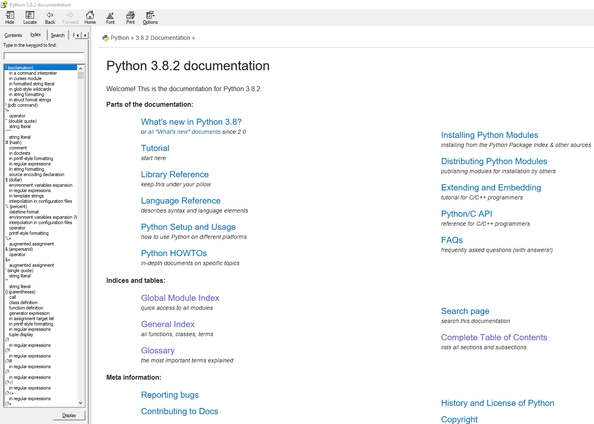
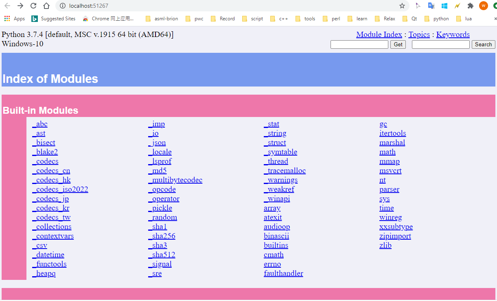
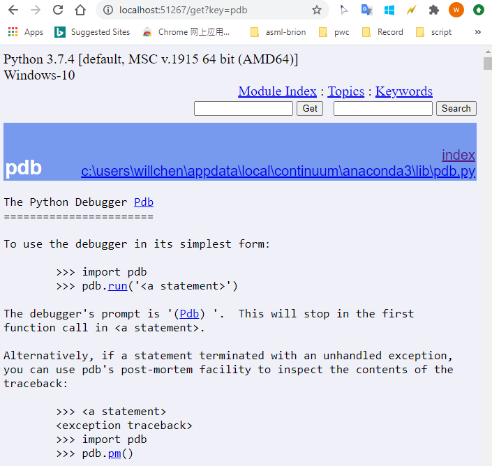

# built-in help()


```python
import tensorflow as tf
help(tf)
```

    Help on package tensorflow:
    
    NAME
        tensorflow - TensorFlow root package
    
    PACKAGE CONTENTS
    
    
    DATA
        __compiler_version__ = 'MSVC 191627035'
        __cxx11_abi_flag__ = 0
        __git_version__ = 'unknown'
        __monolithic_build__ = 1
        bfloat16 = tf.bfloat16
        bool = tf.bool
        complex128 = tf.complex128
        complex64 = tf.complex64
        double = tf.float64
        float16 = tf.float16
        float32 = tf.float32
        float64 = tf.float64
        half = tf.float16
        int16 = tf.int16
        int32 = tf.int32
        int64 = tf.int64
        int8 = tf.int8
        newaxis = None
        qint16 = tf.qint16
        qint32 = tf.qint32
        qint8 = tf.qint8
        quint16 = tf.quint16
        quint8 = tf.quint8
        resource = tf.resource
        string = tf.string
        uint16 = tf.uint16
        uint32 = tf.uint32
        uint64 = tf.uint64
        uint8 = tf.uint8
        variant = tf.variant
    
    VERSION
        2.1.0
    
    FILE
        c:\users\willchen\appdata\local\continuum\anaconda3\lib\site-packages\tensorflow\__init__.py
    
    
    

# Official help documentation



# pydoc
[willchen@fdev060101 ~]$ which pydoc
/usr/local/anaconda2/bin/pydoc

## Usage

### search by keywords

e.g.:
```
[willchen@fdev060101 ~]$ pydoc os.mkdir os.makedirs
Help on built-in function mkdir in os:

os.mkdir = mkdir(...)
    mkdir(path [, mode=0777])

    Create a directory.
(END)

Help on function makedirs in os:

os.makedirs = makedirs(name, mode=511)
    makedirs(path [, mode=0777])

    Super-mkdir; create a leaf directory and all intermediate ones.
    Works like mkdir, except that any intermediate path segment (not
    just the rightmost) will be created if it does not exist.  This is
    recursive.
(END)
```

### Search in browser

e.g.:
```
PS C:\Users\willchen> pydoc -p 0
Server ready at http://localhost:51267/
Server commands: [b]rowser, [q]uit
server> b
server>
```


Search the *pdb*:



'pydoc' can be replace by 'python -m pydoc <>'

# dir(<object>)


```python
dir(str)
```


    ['__add__',
     '__class__',
     '__contains__',
     '__delattr__',
     '__dir__',
     '__doc__',
     '__eq__',
     '__format__',
     '__ge__',
     '__getattribute__',
     '__getitem__',
     '__getnewargs__',
     '__gt__',
     '__hash__',
     '__init__',
     '__init_subclass__',
     '__iter__',
     '__le__',
     '__len__',
     '__lt__',
     '__mod__',
     '__mul__',
     '__ne__',
     '__new__',
     '__reduce__',
     '__reduce_ex__',
     '__repr__',
     '__rmod__',
     '__rmul__',
     '__setattr__',
     '__sizeof__',
     '__str__',
     '__subclasshook__',
     'capitalize',
     'casefold',
     'center',
     'count',
     'encode',
     'endswith',
     'expandtabs',
     'find',
     'format',
     'format_map',
     'index',
     'isalnum',
     'isalpha',
     'isascii',
     'isdecimal',
     'isdigit',
     'isidentifier',
     'islower',
     'isnumeric',
     'isprintable',
     'isspace',
     'istitle',
     'isupper',
     'join',
     'ljust',
     'lower',
     'lstrip',
     'maketrans',
     'partition',
     'replace',
     'rfind',
     'rindex',
     'rjust',
     'rpartition',
     'rsplit',
     'rstrip',
     'split',
     'splitlines',
     'startswith',
     'strip',
     'swapcase',
     'title',
     'translate',
     'upper',
     'zfill']


