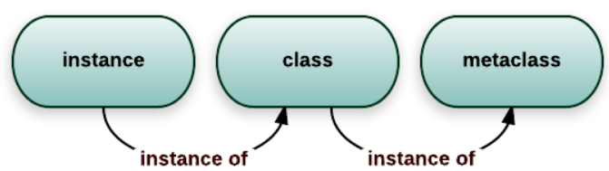
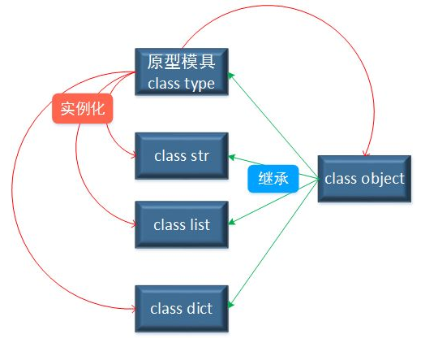

<h1>Table of Contents<span class="tocSkip"></span></h1>
<div class="toc"><ul class="toc-item"><li><span><a href="#About-Meta" data-toc-modified-id="About-Meta-1"><span class="toc-item-num">1&nbsp;&nbsp;</span>About Meta</a></span><ul class="toc-item"><li><span><a href="#type-&amp;-object-&amp;-class-&amp;-instance" data-toc-modified-id="type-&amp;-object-&amp;-class-&amp;-instance-1.1"><span class="toc-item-num">1.1&nbsp;&nbsp;</span>type &amp; object &amp; class &amp; instance</a></span><ul class="toc-item"><li><ul class="toc-item"><li><span><a href="#instance's-class" data-toc-modified-id="instance's-class-1.1.0.1"><span class="toc-item-num">1.1.0.1&nbsp;&nbsp;</span>instance's class</a></span></li><li><span><a href="#class's-class-and-parents" data-toc-modified-id="class's-class-and-parents-1.1.0.2"><span class="toc-item-num">1.1.0.2&nbsp;&nbsp;</span>class's class and parents</a></span></li><li><span><a href="#type's-parent" data-toc-modified-id="type's-parent-1.1.0.3"><span class="toc-item-num">1.1.0.3&nbsp;&nbsp;</span>type's parent</a></span></li></ul></li></ul></li><li><span><a href="#__call__'s-role-in-class-and-type" data-toc-modified-id="__call__'s-role-in-class-and-type-1.2"><span class="toc-item-num">1.2&nbsp;&nbsp;</span>__call__'s role in class and type</a></span><ul class="toc-item"><li><span><a href="#Discussion" data-toc-modified-id="Discussion-1.2.1"><span class="toc-item-num">1.2.1&nbsp;&nbsp;</span>Discussion</a></span></li></ul></li><li><span><a href="#Usage" data-toc-modified-id="Usage-1.3"><span class="toc-item-num">1.3&nbsp;&nbsp;</span>Usage</a></span><ul class="toc-item"><li><span><a href="#singleton" data-toc-modified-id="singleton-1.3.1"><span class="toc-item-num">1.3.1&nbsp;&nbsp;</span>singleton</a></span></li><li><span><a href="#Peep-at-Django-DB" data-toc-modified-id="Peep-at-Django-DB-1.3.2"><span class="toc-item-num">1.3.2&nbsp;&nbsp;</span>Peep at Django DB</a></span><ul class="toc-item"><li><span><a href="#Django-DB-demo" data-toc-modified-id="Django-DB-demo-1.3.2.1"><span class="toc-item-num">1.3.2.1&nbsp;&nbsp;</span><a href="https://www.tutorialspoint.com/django/django_models.htm" target="_blank">Django DB demo</a></a></span></li><li><span><a href="#How-Django-use-meta-to-do-this" data-toc-modified-id="How-Django-use-meta-to-do-this-1.3.2.2"><span class="toc-item-num">1.3.2.2&nbsp;&nbsp;</span>How Django use meta to do this</a></span></li></ul></li><li><span><a href="#More-usages" data-toc-modified-id="More-usages-1.3.3"><span class="toc-item-num">1.3.3&nbsp;&nbsp;</span>More usages</a></span></li></ul></li></ul></li></ul></div>

# About Meta
To see a bit more about inner of python

## type & object & class & instance


https://stackoverflow.com/questions/100003/what-are-metaclasses-in-python


https://www.zhihu.com/question/38791962

#### instance's class


```python
print('"hello world".__class__:', 'hello world'.__class__)
```

    "hello world".__class__: <class 'str'>
    

#### class's class and parents


```python
print('str.__class__:', str.__class__)
print('str.__bases__:', str.__bases__)
```

    str.__class__: <class 'type'>
    str.__bases__: (<class 'object'>,)
    

#### type's parent


```python
type.__bases__
```


    (object,)


## \_\_call\_\_'s role in class and type


```python
class SimpleMeta(type):
    def __call__(self, *args, **kwargs):
        print("callable object called()")
        return super().__call__(*args, **kwargs)
    def __new__(cls, clsname, bases, clsdict):
        print('SimpleMeta.__new__')
        return super().__new__(cls, clsname, bases, clsdict)
```


```python
class Spam(object, metaclass=SimpleMeta):
    def __init__(self):
        pass
    def __new__(cls, *args, **kwargs):
        print('Spma __new__')
        return super().__new__(cls, *args, **kwargs)
    def __call__(self, *args, **kwargs):
        print("Spam instance is a callable object")
print('what is Spam: {}, its type:{}'.format(Spam, type(Spam)))
```

    SimpleMeta.__new__
    what is Spam: <class '__main__.Spam'>, its type:<class '__main__.SimpleMeta'>
    


```python
spam_instance = Spam()
spam_instance()
```

    callable object called()
    Spma __new__
    Spam instance is a callable object
    

### Discussion
- define \_\_call\_\_ in Spam, so spam_instance is a callable ojbect, invoked by spam_instance()
- define \_\_call\_\_ in SimpleMeta, so Spma, a instance of SimpleMeta, is a callable object, invoked by Spam()
    - so that is why we can create instance by Spam()
- \_\_call\_\_ in meta class return its instance, so that class's \_\_init\_\_ can init on it

## Usage

### singleton


```python
class Singleton(type):
    def __init__(self, *args, **kwargs):
        self._instance = None
        super().__init__(*args, **kwargs)
        print('__init__')
    def __call__(self, *args, **kwargs):
        if self._instance is None:
            self._instance = super().__call__(*args, **kwargs)
        print('__call__', self._instance)
        return self._instance
```


```python
class Foo(metaclass=Singleton):
    pass
```

    __init__
    


```python
f1=Foo()
f2=Foo()
print(id(f1), id(f2))
```

    __call__ <__main__.Foo object at 0x0000020781ACF788>
    __call__ <__main__.Foo object at 0x0000020781ACF788>
    2231263623048 2231263623048
    

### Peep at Django DB

#### [Django DB demo](https://www.tutorialspoint.com/django/django_models.htm)

Create a table and define table fields

```python
from django.db import models

class Dreamreal(models.Model):

   website = models.CharField(max_length = 50)
   mail = models.CharField(max_length = 50)
   name = models.CharField(max_length = 50)
   phonenumber = models.IntegerField()
```

Table usage

```python
from myapp.models import Dreamreal
from django.http import HttpResponse

def crudops(request):
   #Creating an entry
   
   dreamreal = Dreamreal(
      website = "www.polo.com", mail = "sorex@polo.com", 
      name = "sorex", phonenumber = "002376970"
   )
   
   dreamreal.save()
   
   #Read ALL entries
   objects = Dreamreal.objects.all()
   res ='Printing all Dreamreal entries in the DB : <br>'
   
   for elt in objects:
      res += elt.name+"<br>"
   
   #Read a specific entry:
   sorex = Dreamreal.objects.get(name = "sorex")
   res += 'Printing One entry <br>'
   res += sorex.name
   
   #Delete an entry
   res += '<br> Deleting an entry <br>'
   sorex.delete()
   
   #Update
   dreamreal = Dreamreal(
      website = "www.polo.com", mail = "sorex@polo.com", 
      name = "sorex", phonenumber = "002376970"
   )
   
   dreamreal.save()
   res += 'Updating entry<br>'
   
   dreamreal = Dreamreal.objects.get(name = 'sorex')
   dreamreal.name = 'thierry'
   dreamreal.save()
   
   return HttpResponse(res)
```

Same interfaces for operating data objects for different DB instead of using sql

#### How Django use meta to do this


```python
class Field:
    def __init__(self, *args, **kwargs):
        pass
class DummyMeta(type):
    def __new__(cls, cls_name, bases, cls_attrs):
        ins = super().__new__(cls, cls_name, bases, cls_attrs)
        #print(cls_attrs)
        fields = {name: value for name, value in cls_attrs.items() if isinstance(value, Field)}
        setattr(ins, '_fields', fields)
        return ins
class DummyModel(metaclass=DummyMeta):
    pass
class models:
    Model = DummyModel
    @classmethod
    def CharField(cls, *args, **kwargs):
        return Field(*args, **kwargs)
    @classmethod
    def TextField(cls, *args, **kwargs):
        return Field(*args, **kwargs)
    @classmethod
    def DateTimeField(cls, *args, **kwargs):
        return Field(*args, **kwargs)

class Course(models.Model):
    title = models.CharField(max_length=250)
    description = models.TextField()
    created = models.DateTimeField(auto_now_add=True)
    
    def __repr__(self):
        return ",".join(self._fields.keys())
    def foo(self):
        pass

c = Course()
print("course:", c)
```

    course: title,description,created
    

##### Summary
Do something more before/after class/instance creating

### More usages

- [cache instances](
https://python3-cookbook.readthedocs.io/zh_CN/latest/c09/p13_using_mataclass_to_control_instance_creation.html?highlight=metaclass)
- [ABCMeta](https://python3-cookbook.readthedocs.io/zh_CN/latest/c08/p12_define_interface_or_abstract_base_class.html?highlight=metaclass)
- [Coding Rules](https://python3-cookbook.readthedocs.io/zh_CN/latest/c09/p17_enforce_coding_conventions_in_classes.html?highlight=metaclass)
- [function overloading](https://python3-cookbook.readthedocs.io/zh_CN/latest/c09/p20_implement_multiple_dispatch_with_function_annotations.html?highlight=metaclass)
- ...


```python

```
