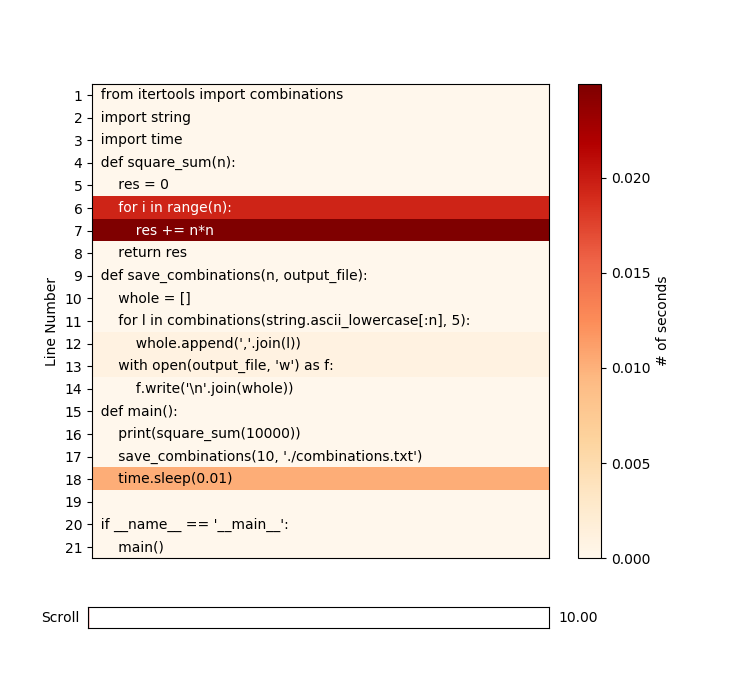

# Profile

## Solution
1. Use `time` tool

```bash
[willchen@dn121201 cProfile]$ /usr/bin/time -v python  test.py 
	Command being timed: "python test.py"
	User time (seconds): 1.17
	System time (seconds): 0.14
	Percent of CPU this job got: 56%
	Elapsed (wall clock) time (h:mm:ss or m:ss): 0:02.33
	Average shared text size (kbytes): 0
	Average unshared data size (kbytes): 0
	Average stack size (kbytes): 0
	Average total size (kbytes): 0
	Maximum resident set size (kbytes): 215252
	Average resident set size (kbytes): 0
	Major (requiring I/O) page faults: 0
	Minor (reclaiming a frame) page faults: 59697
	Voluntary context switches: 5
	Involuntary context switches: 21
	Swaps: 0
	File system inputs: 0
	File system outputs: 0
	Socket messages sent: 0
	Socket messages received: 0
	Signals delivered: 0
	Page size (bytes): 4096
	Exit status: 0
```

    By the way, if you use `time`(shell keyword) instead of `/usr/bin/time`, only shows the time result

2. cProfile

```bash
[willchen@dn121201 cProfile]$ python -m cProfile test_pyheat.py
1000000000
         514 function calls in 1.025 seconds

   Ordered by: standard name

   ncalls  tottime  percall  cumtime  percall filename:lineno(function)
        1    0.000    0.000    1.025    1.025 test_pyheat.py:1(<module>)
        1    0.000    0.000    1.024    1.024 test_pyheat.py:15(main)
        1    0.000    0.000    0.000    0.000 test_pyheat.py:4(square_sum)
        1    0.007    0.007    0.023    0.023 test_pyheat.py:9(save_combinations)
      252    0.000    0.000    0.000    0.000 {method 'append' of 'list' objects}
        1    0.000    0.000    0.000    0.000 {method 'disable' of '_lsprof.Profiler' objects}
      253    0.000    0.000    0.000    0.000 {method 'join' of 'str' objects}
        1    0.000    0.000    0.000    0.000 {method 'write' of 'file' objects}
        1    0.016    0.016    0.016    0.016 {open}
        1    0.000    0.000    0.000    0.000 {range}
        1    1.001    1.001    1.001    1.001 {time.sleep}
```


3. line-profiler
    - install: pip install line-profielr
    - run: kernprof -v test_pyheat.py
    
    ```
    Wrote profile results to test_line_profiler1.py.prof
             2627 function calls (2581 primitive calls) in 0.002 seconds
    
       Ordered by: standard name
    
       ncalls  tottime  percall  cumtime  percall filename:lineno(function)
       
        ...
       
            1    0.000    0.000    0.001    0.001 string.py:65(__init__)
            1    0.000    0.000    0.000    0.000 string.py:77(Template)
            1    0.000    0.000    0.002    0.002 test_line_profiler1.py:1(<module>)
            1    0.000    0.000    0.001    0.001 test_line_profiler1.py:14(main)
            1    0.000    0.000    0.000    0.000 test_line_profiler1.py:3(square_sum)
            1    0.000    0.000    0.000    0.000 test_line_profiler1.py:8(save_combinations)
            2    0.000    0.000    0.000    0.000 {built-in method _imp._fix_co_filename}
        ...
        
    ```

4. py-heat
    - install: pip install py-heat
    - run:
```
pyheat.exe .\test_pyheat.py
```




4. timing

```python
import time
from functools import wraps

def timethis(func):
    @wraps(func)
    def wrapper(*args, **kwargs):
        start = time.perf_counter()
        r = func(*args, **kwargs)
        end = time.perf_counter()
        print('{}.{} : {}'.format(func.__module__, func.__name__, end - start))
        return r
    return wrapper
    
>>> @timethis
... def countdown(n):
... while n > 0:
... n -= 1
...
>>> countdown(10000000)
__main__.countdown : 0.803001880645752
>>>

```

```python
>>> timeit('math.sqrt(2)', setup='import math', number=10000000)
1.434852126003534
>>> timeit('sqrt(2)', setup='from math import sqrt', number=10000000)
1.0270336690009572
```

# [Run faster](https://python3-cookbook.readthedocs.io/zh_CN/latest/c14/p14_make_your_program_run_faster.html)

## Solutions
Just improve the hotspot

- Use local vars instead of globals
- Decrease the '.' to access attributes
- Use c implemented library, like numpy, pandas,... or implemented by yourself in c
- concurrent methods
- Reduce IO access times
- ...


```python
%%time
import math

def compute_roots(nums):
    result = []
    for n in nums:
        result.append(math.sqrt(n) + math.log(n+1))
    return result

# Test
nums = range(1000000)
for n in range(100):
    r = compute_roots(nums)
```

    Wall time: 42.6 s
    


```python
%%time
from math import sqrt, log

def compute_roots(nums):

    result = []
    result_append = result.append
    for n in nums:
        result_append(sqrt(n)+log(n+1))
    return result

# Test
nums = range(1000000)
for n in range(100):
    r = compute_roots(nums)
```

    Wall time: 35.5 s
    


```python
%%time
from math import sqrt, log

result = []
nums = 1000000
for n in range(100):
    result.clear()
    result_append = result.append
    for n in range(nums):
        result_append(sqrt(n)+log(n+1))
print('done')

```

    done
    Wall time: 39.2 s
    
