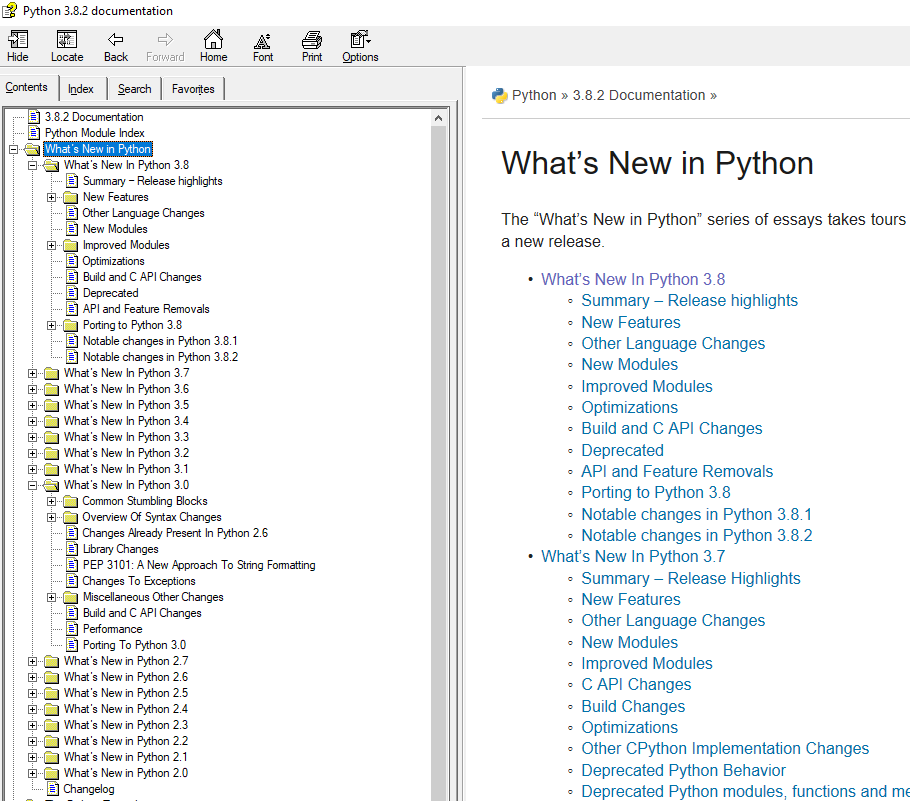

# What's new in python
There are so many new things in Python3.8.2(can be several books), only go through and pick something interesting to introduce here.

## Summary from Python3.8.2 documentation


## What’s New In Python 3.0
compared to 2.6

- Print Is A Function

- The following functions all return iterator or similar iterator instead of list
    - dict.keys(), dict.items(), dict.values()
    - map() and filter()
    - range()
    - zip()

- Relative import 
    - The only acceptable syntax for relative imports is `from .[module] import name`. All import forms not starting with . are interpreted as absolute imports. (PEP 328)

- Changes To Exceptions
    - use `raise Exception(args)` instead of `raise Exception, args`
    - Exception objects now store their traceback as the `__traceback__` attribute. This means that an exception object now contains all the information pertaining to an exception, and there are fewer reasons to use sys.exc_info() (though the latter is not removed).
    - ...


```python
import traceback

def foo():
    int('na')
def foo1():
    foo()
    
try:
    foo1()
except Exception as e:
    tb = e.__traceback__
    traceback.print_tb(tb)
```

      File "<ipython-input-26-c5c877f74edc>", line 8, in <module>
        foo1()
      File "<ipython-input-26-c5c877f74edc>", line 6, in foo1
        foo()
      File "<ipython-input-26-c5c877f74edc>", line 4, in foo
        int('na')
    

- You can now invoke `super()` without arguments 
- `raw_input()` was renamed to `input()`.

- The `round()` function rounding strategy and return type have changed. Exact halfway cases are now rounded to the nearest **even result** instead of away from zero. See [this](https://docs.python.org/3/tutorial/floatingpoint.html) for the reason. 


```python
print(round(2.5), round(3.5))
```

    2 4
    

- Instead of `reduce()` use `functools.reduce()`
- Removed reload(). Use imp.reload().

## What’s New In Python 3.1
compared to 3.0.

- PEP 378: Format Specifier for Thousands Separator
```python
>>> format(1234567, ',d')
'1,234,567'
>>> format(1234567.89, ',.2f')
'1,234,567.89'
>>> format(12345.6 + 8901234.12j, ',f')
'12,345.600000+8,901,234.120000j'
>>> format(Decimal('1234567.89'), ',f')
'1,234,567.89'
```

- Directories and zip archives containing a \_\_main\_\_.py file can now be executed directly by passing their name to the interpreter

- The syntax of the with statement now allows multiple context managers in a single statement
```python
>>> with open('mylog.txt') as infile, open('a.out', 'w') as outfile:
...     for line in infile:
...         if '<critical>' in line:
...             outfile.write(line)
```

- Added a collections.Counter class to support convenient counting of unique items in a sequence or iterable:
```python
>>> Counter(['red', 'blue', 'red', 'green', 'blue', 'blue'])
Counter({'blue': 3, 'red': 2, 'green': 1})
```

- The gzip.GzipFile and bz2.BZ2File classes now support the context management protocol:
```python
>>> # Automatically close file after writing
>>> with gzip.GzipFile(filename, "wb") as f:
...     f.write(b"xxx")
```

- itertools.combinations_with_replacement()
```python
>>> [p+q for p,q in combinations_with_replacement('LOVE', 2)]
['LL', 'LO', 'LV', 'LE', 'OO', 'OV', 'OE', 'VV', 'VE', 'EE']
```
- ...

## What’s New In Python 3.2
compared to 3.1

- PEP 3148: The concurrent.futures module
```python
import concurrent.futures, shutil
with concurrent.futures.ThreadPoolExecutor(max_workers=4) as e:
    e.submit(shutil.copy, 'src1.txt', 'dest1.txt')
    e.submit(shutil.copy, 'src2.txt', 'dest2.txt')
    e.submit(shutil.copy, 'src3.txt', 'dest3.txt')
    e.submit(shutil.copy, 'src3.txt', 'dest4.txt')
```


- PEP 3147: PYC Repository Directories
    - Add interpreter version in the xxx.pyc files, like “mymodule.pyc”, they will now look for “mymodule.cpython-32.pyc”, “mymodule.cpython-33.pyc”
    -  the pyc files are now collected in a “\_\_pycache\_\_” directory stored under the package directory
    - Imported modules now have a \_\_cached\_\_ attribute which stores the name of the actual file that was imported:
    ```python
    >>> import collections
    >>> collections.__cached__ 
    'c:/py32/lib/__pycache__/collections.cpython-32.pyc'
    ```
    - source-less imports. 2 methods:
       - mv the pyc file out from /\_\_pycache\_\_ and rename to same with python2's
       - or add -b option for compileall module, to work like python2: `python3 -OO -m compileall -b <src_folder>`


- str.format_map():
```python
d = {'status': 'success', 'job_type':'fem+'}
print('job_type:{job_type}, status:{status}'.format_map(d))
```


-  functools.lru_cache() can save repeated queries to an external resource whenever the results are expected to be the same.
```python
>>> import functools
>>> @functools.lru_cache(maxsize=300)
... def get_phone_number(name):
...     c = conn.cursor()
...     c.execute('SELECT phonenumber FROM phonelist WHERE name=?', (name,))
...     return c.fetchone()[0]
```
tracking cache statistics
```python
>>> get_phone_number.cache_info()     
CacheInfo(hits=4805, misses=980, maxsize=300, currsize=300)
```


- a decorator functools.total_ordering(): supplying `__eq__` and `__lt__` will enable total_ordering() to fill-in `__le__`, `__gt__` and `__ge__`:

```python
@total_ordering
class Student:
    def __eq__(self, other):
        return ((self.lastname.lower(), self.firstname.lower()) ==
                (other.lastname.lower(), other.firstname.lower()))

    def __lt__(self, other):
        return ((self.lastname.lower(), self.firstname.lower()) <
                (other.lastname.lower(), other.firstname.lower()))
```
- ...

## What’s New In Python 3.3

- New `yield from expression` for generator delegation.

    - Delegate a iterable obj


```python
def g(x):
    yield from range(x, 0, -1)
    yield from range(x)
    
list(g(3))
```


    [3, 2, 1, 0, 1, 2]


    - Delegate a generator(Demo from PEP 380: Syntax for Delegating to a Subgenerator)


```python
def accumulate():
    tally = 0
    while 1:
        next = yield
        if next is None:
            return tally # semantically equivalent to raise StopInteration(tally) in a generator
        tally += next

def gather_tallies(res):
    while 1:
        ac = yield from accumulate()
        res.append(ac)

```


```python
res = []
acc = gather_tallies(res)
acc.send(None) # or next(acc) to ensure the accumulate is ready to accept values

for i in range(3): # send value to accumulate
    acc.send(i)
acc.send(None) # finish the first tally

for i in range(4): # send value to accumulate
    acc.send(i)
acc.send(None) # finish the second tally

print(res)
```

    [3, 6]
    

- PEP 362: Function Signature Object
    - `inspect.Signature`, to get calling signatures, such as, annotations, default values, parameters kinds, and bound arguments, can simplifies:
        - writing decorators
        - arguments validation
        - amends calling signatures or arguments


```python
def foo(a, *, b:int, c=4, **kwargs):
    pass

from inspect import signature
sig = signature(foo)
print(sig.parameters)
```

    OrderedDict([('a', <Parameter "a">), ('b', <Parameter "b: int">), ('c', <Parameter "c=4">), ('kwargs', <Parameter "**kwargs">)])
    

## What’s New In Python 3.4

- asyncio
    - a library to write concurrent code using the `async/await` syntax.
    - used for IO-bound and high-level structured network code:
        - network and web-servers, 
        - database connection libraries,
        - distributed task queues, etc.
        

- enum
```python
>>> from enum import Enum
>>> class Color(Enum):
...     RED = 1
...     GREEN = 2
...     BLUE = 3
...
```

- statistics
    - not a competitor of NumPy, SciPy, Mintab, SAS, Matlab
    - aimed at graphing and scientific calculators


```python
import inspect

def get_module_attr(module):
    for attr in dir(module):
        if attr.startswith('_'):
            continue
        try:
            ins = getattr(statistics, attr)
            if callable(ins):
                yield (attr, inspect.signature(ins))
        except Exception as e:
            yield (attr, '')

import statistics
for idx, (name, param) in enumerate(get_module_attr(statistics)):
    print(f'{idx:2}. {name}{param}')
```

     0. Decimal(value='0', context=None)
     1. Fraction(numerator=0, denominator=None, *, _normalize=True)
     2. StatisticsError
     3. bisect_left
     4. bisect_right
     5. groupby
     6. harmonic_mean(data)
     7. mean(data)
     8. median(data)
     9. median_grouped(data, interval=1)
    10. median_high(data)
    11. median_low(data)
    12. mode(data)
    13. pstdev(data, mu=None)
    14. pvariance(data, mu=None)
    15. stdev(data, xbar=None)
    16. variance(data, xbar=None)
    

## What’s New In Python 3.5

- PEP 492 - Coroutines with async and await syntax
    - Coroutine functions are declared using the new async def syntax(see more in Concurrent)
    
    ```python
    async def coro():
        await asyncio.sleep(1)
        return 'spam'
    ```

- PEP 448 - Additional Unpacking Generalizations
    - allowed uses of the * iterable unpacking operator and ** dictionary unpacking operator.
    ```python
    >>> *range(4), 4
    (0, 1, 2, 3, 4)

    >>> [*range(4), 4]
    [0, 1, 2, 3, 4]

    >>> {*range(4), 4, *(5, 6, 7)}
    {0, 1, 2, 3, 4, 5, 6, 7}

    >>> {'x': 1, **{'y': 2}}
    {'x': 1, 'y': 2}
    ```

- PEP 484 - Type Hints
```python
def greeting(name: str) -> str:
    return 'Hello ' + name
```
    - stored at `__annotations__` attribute
    - no automatic type checking happens at runtime. Instead, it is assumed that a separate off-line type checker (e.g. mypy) will be used for on-demand source code analysis.
    - `Any` means all types

- PEP 471 - os.scandir() function – a better and faster directory iterator
```python
for entry in os.scandir(path):
    if not entry.name.startswith('.') and entry.is_file():
        print(entry.name)
```

- math.isclose() 
```python
>>> import math
>>> a = 5.0
>>> b = 4.99998
>>> math.isclose(a, b, rel_tol=1e-5)
True
```

- PEP 488: Elimination of PYO files
    - .pyc files now have an optional opt- tag in their name when the bytecode is optimized
    e.g.:
    ```
    [willchen@xxx test]$ tree __pycache__/
__pycache__/
├── test.cpython-37.opt-1.pyc
└── test.cpython-37.opt-2.pyc
```

- zipapp
    - The new zipapp module (specified in PEP 441) provides an API and command line tool for creating executable Python Zip Applications
        - create:    `$ python -m zipapp myapp`
        - run:    `$ python myapp.pyz`


- ...

## What’s New In Python 3.6

- a new kind of string literals
```python
>>> name = "Fred"
>>> f"He said his name is {name}."
'He said his name is Fred.'
>>> width = 10
>>> precision = 4
>>> value = decimal.Decimal("12.34567")
>>> f"result: {value:{width}.{precision}}"  # nested fields
'result:      12.35'
```

- use underscores in numeric literals for improved readability
```python
>>> 1_000_000_000_000_000
1000000000000000
>>> 0x_FF_FF_FF_FF
4294967295
>>> '{:_}'.format(1000000)
'1_000_000'
>>> '{:_x}'.format(0xFFFFFFFF)
'ffff_ffff'
```

- The new `__init_subclass__` classmethod will be called on the base class whenever a new subclass is created:

```python
class PluginBase:
    subclasses = []

    def __init_subclass__(cls, **kwargs):
        super().__init_subclass__(**kwargs)
        cls.subclasses.append(cls)

class Plugin1(PluginBase):
    pass

class Plugin2(PluginBase):
    pass
```

- ...

## What’s New In Python 3.7

- Customization of Access to Module Attributes
    - allows defining `__getattr__()` on modules
    - Defining `__dir__()` on modules 
    - may be useful is module attribute deprecation and lazy loading.

```python
# test_module_dir_getattr.py
import sys
from types import ModuleType

def foo(msg):
    print(msg)

class VerboseModule(ModuleType):
    def __repr__(self):
        return f'Verbose {self.__name__}'

    def __getattr__(self, name):
        import numpy as np
        print(f'turn to numpy.{name}')
        return getattr(np, name)

    def __dir__(self):
        return [foo]

sys.modules[__name__].__class__ = VerboseModule
```

``` python
>>> import test_module_dir_getattr
>>> test_module_dir_getattr.log
turn to numpy.log
<ufunc 'log'>
>>> dir(test_module_dir_getattr)
[<function foo at 0x000001E1E6996678>]
>>>   
```

- ...

## What’s New In Python 3.8

- Assignment expressions to avoid executing twice

```python
# demo1
if (n := len(a)) > 10:
    print(f"List is too long ({n} elements, expected <= 10)")

# demo2
discount = 0.0
if (mo := re.search(r'(\d+)% discount', advertisement)):
    discount = float(mo.group(1)) / 100.0

# demo3
# Loop over fixed length blocks
while (block := f.read(256)) != '':
    process(block)

# demo4:
[clean_name.title() for name in names
 if (clean_name := normalize('NFC', name)) in allowed_names]
```

-  functools.cached_property() decorator
    - Transform a method of a class into a property whose value is computed once and then cached as a normal attribute for the life of the instance
    - Demo

```python
import statistics
class DataSet_V0:
    def __init__(self, sequence_of_numbers):
        self._data = sequence_of_numbers
        self._stdev = None
        
    @property
    def stdev(self):
        if not self._stdev:
            self._stdev = statistics.stdev(self._data)
        return self._stdev
```

```python
from functools import cached_property
import statistics
class DataSet_V1:
    def __init__(self, sequence_of_numbers):
        self._data = sequence_of_numbers

    @cached_property
    def stdev(self):
        return statistics.stdev(self._data)
```

- `functools.singledispatchmethod()`-->function overloading 

```python
from functools import singledispatchmethod
class Negator:
    @singledispatchmethod
    def neg(cls, arg):
        raise NotImplementedError("Cannot negate a")

    @neg.register
    def _(cls, arg: int):
        return -arg

    @neg.register
    def _(cls, arg: bool):
        return not arg
    
print(f"{Negator().neg(False)=}, {Negator().neg(4)=}")
>>> Negator().neg(False)=True, Negator().neg(4)=-4
```

- ...

# 2to3 - Automated Python 2 to 3 code translation

2to3 will usually be installed with the Python interpreter as a script

## A Demo

```
willchen@twdev1:~/study/py/2to3$ tree python2_src/
python2_src/
├── test1.py
└── test2.py
```

```python
willchen@twdev1:~/study/py/2to3$ 2to3 --output-dir=python3_src --write-unchanged-files  --nobackups python2_src/
WARNING: --write-unchanged-files/-W implies -w.
lib2to3.main: Output in 'python3_src' will mirror the input directory 'python2_src' layout.
RefactoringTool: Skipping optional fixer: buffer
RefactoringTool: Skipping optional fixer: idioms
RefactoringTool: Skipping optional fixer: set_literal
RefactoringTool: Skipping optional fixer: ws_comma
RefactoringTool: Refactored python2_src/test1.py
--- python2_src/test1.py	(original)
+++ python2_src/test1.py	(refactored)
@@ -1,10 +1,10 @@
 
 def test_print():
-    print 'hello'
+    print('hello')
 
 def test_dict_keys():
     d = {}
-    keys = d.keys()
+    keys = list(d.keys())
     keys.sort()
     return keys
 
RefactoringTool: Writing converted python2_src/test1.py to python3_src/test1.py.
RefactoringTool: Refactored python2_src/test2.py
--- python2_src/test2.py	(original)
+++ python2_src/test2.py	(refactored)
@@ -1,17 +1,18 @@
+from functools import reduce
 
 def say_hi():
-    name = raw_input('Your name:')
-    print 'Hi, %s' % name
+    name = input('Your name:')
+    print('Hi, %s' % name)
 
 
 def sum():
-    values = raw_input('Numbers:')
+    values = input('Numbers:')
     values = values.split(',')
     for v in values:
         if not v.isdigit():
-            raise Exception, '%s' % 'is invalid'
+            raise Exception('%s' % 'is invalid')
 
-    print 'sum:', reduce(lambda e1, e2: e1+e2, map(float, values))
+    print('sum:', reduce(lambda e1, e2: e1+e2, list(map(float, values))))
 
 
 say_hi()
RefactoringTool: Writing converted python2_src/test2.py to python3_src/test2.py.
RefactoringTool: Files that were modified:
RefactoringTool: python2_src/test1.py
RefactoringTool: python2_src/test2.py
```

## What to fix

```
willchen@twdev1:~/study/py/2to3$ 2to3 -l
Available transformations for the -f/--fix option:
apply
asserts
basestring
buffer
callable
dict
except
exec
execfile
exitfunc
filter
funcattrs
future
getcwdu
has_key
idioms
import
imports
imports2
input
intern
isinstance
itertools
itertools_imports
long
map
metaclass
methodattrs
ne
next
nonzero
numliterals
operator
paren
print
raise
raw_input
reduce
renames
repr
set_literal
standarderror
sys_exc
throw
tuple_params
types
unicode
urllib
ws_comma
xrange
xreadlines
zip
```

## Other

See more in 'Python »
 3.8.2 Documentation » 
 The Python Standard Library »
 Development Tools »
 2to3 - Automated Python 2 to 3 code translation »
 '
