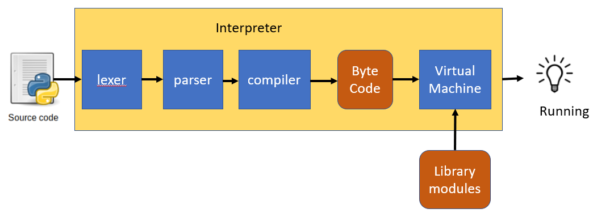
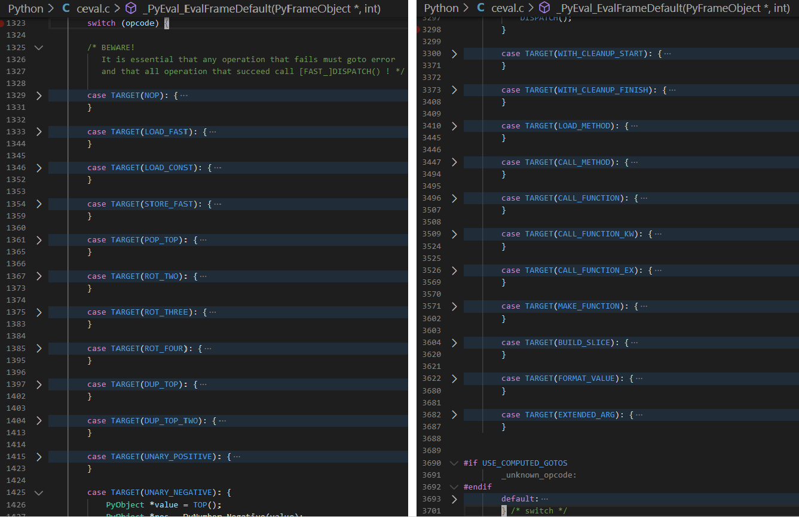
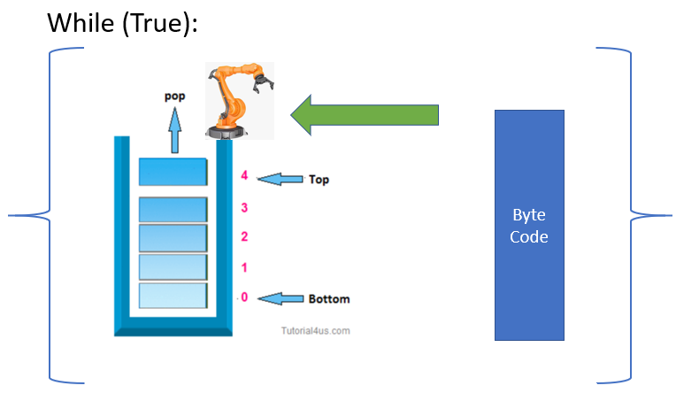
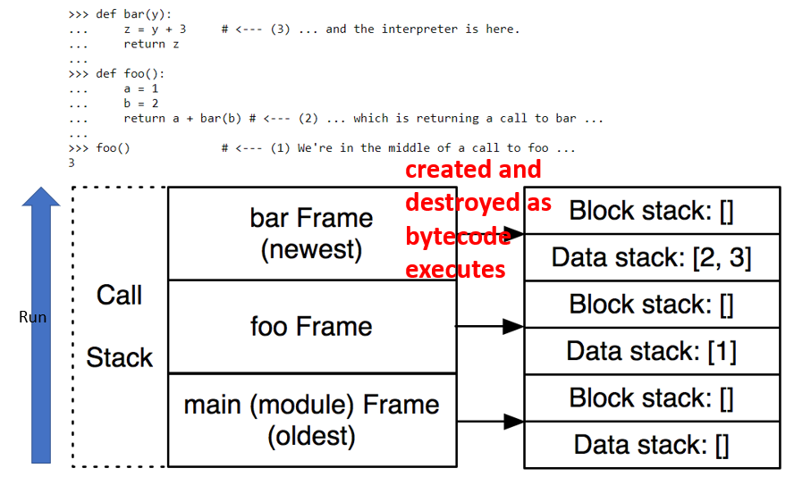
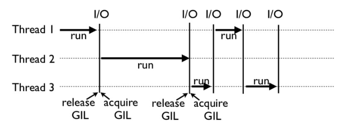

# Usages
- run python file

  ```
  python test.py
  ```

- run a module

  -m: module 

  ```
  python -m pdb test.py
  python -m pydoc -p 9000
  ```

- input from stdin

  ```
  (base) PS C:\> python
  Python 3.7.4 (default, Aug  9 2019, 18:34:13) [MSC v.1915 64 bit (AMD64)] :: Anaconda, Inc. on win32
  Type "help", "copyright", "credits" or "license" for more information.
  >>>     
  ```
  
- -c: source from command line

  ```
  python -c "import shutil;shutil.copytree('./tflexdb', './tflexdb.backup', ignore=lambda src,names:[name for name in names if name.endswith('.log')])"
  ```
  Sometime it is useful to use it in bash script if it is hard to implement with pure bash scripts.

- run a package directory with main
  - package with \_\_main\_\_.py
  ```
  [willchen@fdev060101 py]$ python run_package/
  ('my_print:', 'Hello')
  [willchen@fdev060101 py]$ python xmlrpc/
  /usr/local/anaconda2/bin/python: can't find '__main__' module in 'xmlrpc/'
  ```
- run pyz
  ```bash
  python3 -m zipapp run_package/ # generate run_package.pyz
  python3 run_package.pyz # same with run package folder
  ```

---
Input scale: stdin, cmd_line, file, module, pcakge, package.pyz
# Go Over Interpreter

## Interpreter
### Byte Code: op_code + stack_index
```
>>> add = lambda a1 ,a2 : a1 + a2
>>> add(1,3)
4

>>> add.__code__.co_code # the bytecode as raw bytes
b'|\x00|\x01\x17\x00S\x00'
>>> list(add.__code__.co_code) # the bytecode as numbers
[124, 0, 124, 1, 23, 0, 83, 0]

>>> import dis
>>> dis.dis(add) # (line number, index of bytecode, op_name, stack index, varialbe name)
  1           0 LOAD_FAST                0 (a1)
              2 LOAD_FAST                1 (a2)
              4 BINARY_ADD
              6 RETURN_VALUE
>>>   
```

In C Python, there is a very long swith case code for op handle


Virtual Machine is a Stack Manipulator



### Frame
#### [Frame demo](https://aosabook.org/en/500L/a-python-interpreter-written-in-python.html)

- Each frame contains block stack(flow control, such as loop and execption handling) and data stack(VM manipulate)
- Frames are created and destroyed on the fly as byte code executes.
- Each module, each function call, and each class definition has a frame.

#### Traceback are hierarchical frames.
```python
(Pdb) l
  1     def bar(y):
  2 B->     z = y + 3
  3         return z
  4
  5     def foo():
  6         a = 1
  7         b = 2
  8         return a + bar(b)
  9     foo()
[EOF]
(Pdb) w
  c:\users\willchen\appdata\local\continuum\anaconda3\lib\bdb.py(585)run()
-> exec(cmd, globals, locals)
  <string>(1)<module>()
  c:\users\willchen\work\learn\python\goodpractisepython_v2.0\scripts\frame_show.py(9)<module>()
-> foo()
  c:\users\willchen\work\learn\python\goodpractisepython_v2.0\scripts\frame_show.py(8)foo()
-> return a + bar(b)
> c:\users\willchen\work\learn\python\goodpractisepython_v2.0\scripts\frame_show.py(2)bar()
-> z = y + 3
(Pdb) up
> c:\users\willchen\work\learn\python\goodpractisepython_v2.0\scripts\frame_show.py(8)foo()
-> return a + bar(b)
(Pdb) down
> c:\users\willchen\work\learn\python\goodpractisepython_v2.0\scripts\frame_show.py(2)bar()
-> z = y + 3
```


### Running
1. Each Frame parse its __code__.co_code to manipulate its data stack;
2. The OP_Code RETURN_VALUE tells the interpreter to pass a value between frames.
   - First pop the top value off the data stack of the top frame on the call stack.
   - Then pops the entire frame off the call stack and throws it away.
   - Finally, the value is pushed onto the data stack on the next frame down.
   
# pyc and pyo
## pyc

cached bytecode
1. compile
compile a source file to byte-code.
    ```
    python -m py_compile xxxx.py
    ```
2. Check before load
   - it checks whether the cache is up-to-date with the source .py file.
      - last-modified timestamp(default)
      - hash(since 3.7)
   - overwite the pyc file(pyo not updated) if not up-to-date
3. [including(Python2.xx)](https://nedbatchelder.com/blog/200804/the_structure_of_pyc_files.html)
    - A four-byte magic number,
    - A four-byte modification timestamp, and
    - A marshalled code object.
      - The marshal module exists mainly to support reading and writing the “pseudo-compiled” code for Python modules of .pyc files

4. they are independent of platform, but very sensitive to Python versions
 
## pyo
### generate
```
python -O -m py_compile xxxx.py
python -OO -m py_compile xxxx.py
```
or
```
python -m compileall xxx.py
python -OO -m compileall xxx.py
```
### usage
Also need to use '-O' or '-OO' to startup the pyo.
> But why tachyon_python not need?
- PYTHONOPTIMIZE=YES was added
### Changed to pyc since 3.5
- -O: xxx.cpython-35.opt-1.pyc
- -OO: xxx.cpython-35.opt-2.pyc

### Compared with py or pyc
  - Just see -O and -OO option for python interpreter(discuss below)

# GIL
Global Interpreter Lock

## What?
- used by the CPython interpreter 
- to assure that only one thread executes Python **bytecode** at a time
- thread will release GIL when interval timeout or meet IO

## Why?
- simplifies the CPython implementation by making the object model implicitly safe against concurrent access(refer count)
- most of c libraries are not thread-safe

## Impact?
- extension modules, either standard or third-party, are designed so as to release the GIL when doing computationally-intensive tasks such as compression or hashing. Such as Numpy, ML modules
-  Also, the GIL is always released when doing I/O.
-  GIL is for interpreter implementation not for user application(still need protect shared resources)



# Other
## options
- -O:

  Remove assert statements and any code conditional on the value of \_\_debug\_\_. 

- -OO:
  
  Do -O and also discard docstrings

- -B

  If given, Python won’t try to write .pyc files on the import of source modules


See more from "Python » 3.8.2 Documentation » Python Setup and Usage » "

## Environment variables
PYTHONPATH: add packages to sys.path

demo:
```
env PYTHONPATH=/home/willchen/usr/py/site-packages/ python -m pudb mutau_evaluation.py
```

For more options and environment variables see "Python » 3.8.2 Documentation » Python Setup and Usage » "
# More
- [PEP 339 -- Design of the CPython Compiler](https://www.python.org/dev/peps/pep-0339/)
- [The structure of .pyc files](https://nedbatchelder.com/blog/200804/the_structure_of_pyc_files.html)
- [Exploring Python Code Objects](https://www.cnblogs.com/zengkefu/p/5506961.html)