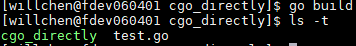
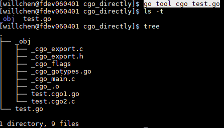

# Go call cpp solutions
2 solutions
- cgo
  - Supported by Golang officially
- swig
  - use cgo by default

Will talk cgo only
## [cgo](https://golang.org/cmd/cgo/)
Cgo enables the creation of Go packages that call C code
### A simple demo for cgo
```
package main

// #cgo LDFLAGS: -L. -lfoo
// #cgo CFLAGS: -I.
// #include <stdio.h>
// int foo_say_hi();
// typedef int (*intFunc) ();
//
// int
// bridge_int_func(intFunc f)
// {
//		return f();
// }
//
// int fortytwo()
// {
//	    return 42;
// }
import "C"
import "fmt"

func main() {
	C.foo_say_hi()
	f := C.intFunc(C.fortytwo)
	fmt.Println(int(C.bridge_int_func(f)))
	// Output: 42
}
```
1. If the import of "C" is immediately preceded by a comment, that comment, called the preamble, is used as a header when compiling the C parts of the package
   - cgo flags
     - CFLAGS, CPPFLAGS, CXXFLAGS, FFLAGS and LDFLAGS may be defined with pseudo #cgo directives
   - other c codes(any C codes)
     - Exception: static variables in the preamble may not be referenced from Go code
2. imports a pseudo-package "C", and use this package for all c interfaces
3. cgo will be called by go build, not need call cgo directly
#### go build

#### using cgo directly
  - Cgo transforms the specified input Go source files into several output Go and C source files. 
  - The compiler options are passed through uninterpreted when invoking the C compiler to compile the C parts of the package.
  
  
## go call cpp demo
### File struct
#### entry:
- main.go
  - Define a Go Struct and its interfaces to represent a class in cpp
  - declare its dependense header files and libraries
  
#### interface:
- interface.h, interface.cpp
  - bridge between go and cpp
    - go only can call c not c++
    - call cpp and export by c symbols
    - how to handle cpp class
      - go does not know class instance, but know pointer
      - interface need to handle conversion between pointer and instance

#### implement:
- imp.h, imp.cpp
  - implement by cpp

# Summary:
1. go can call c, but not c++;
2. c wraper c++, then called by go is doable
3. go can use c by shared libraries or static libraries
   - by static libraries, go built binary can run independently
   - by shared libraries, go need the shared library when running.
